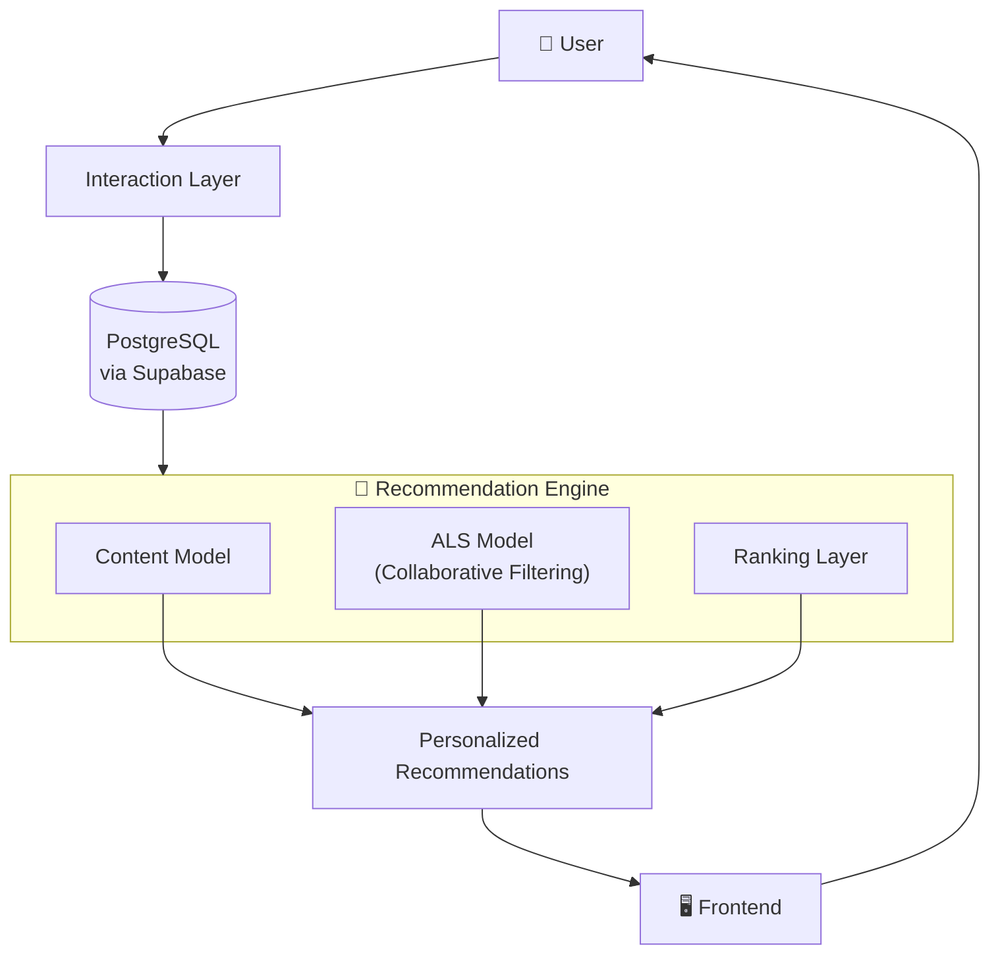

<div align="center">


<a href="#">
  
</a>

<br/>

<p>
  
  
  
  
  
  
</p>

<p>
  
  
  
  
  
</p>

</div>

<br/>

<p align="center">
  
</p>

<p align="center">
  <strong>Skill-Metric is a live, working platform</strong> that uses machine learning to tell you exactly what to learn next — not just another list of courses. Real recommendation models, real skill tracking, real roadmaps.
</p>

<div align="center">

[](#)
[](../../stargazers)

</div>

---

## 📑 Table of Contents

- [Why This Exists](#-why-this-exists)
- [The Core Idea](#-the-core-idea)
- [What You Can Actually Do With It](#-what-you-can-actually-do-with-it)
- [The Machine Learning Engine](#-the-machine-learning-engine)
- [How a Recommendation Gets Made](#-how-a-recommendation-gets-made)
- [Where the ML Is Headed](#-where-the-ml-is-headed)
- [System Architecture](#️-system-architecture)
- [Tech Stack](#️-tech-stack)
- [What's Built vs. What's Next](#-whats-built-vs-whats-next)
- [Getting Started](#-getting-started)
- [Author](#-author)

---

## ❌ Why This Exists

If you've ever tried to learn something new — a language, a framework, ML itself — you already know the real problem isn't a *lack* of resources. It's the opposite.

There are a million tutorials, courses, and roadmaps out there, and figuring out which one is actually right for **you**, at **your** level, for **your** goal, ends up eating more time than the learning itself.

Right now, most people's learning time looks like this:

```text
🔍 50% Searching for the "right" resource
📖 50% Actually learning
```

Skill-Metric exists to flip that ratio:

```text
📖 95% Learning
🔍  5% Searching
```

No more tab-hoarding fifteen "best roadmap" articles. No more guessing whether you should learn Pandas before Statistics. The platform figures that part out for you.

---

## 💡 The Core Idea

Most platforms answer: **"Which course should I take?"**

Skill-Metric answers a bigger question:

> **"I want to become an ML Engineer. Now what?"**

And it works through the whole chain for you:

```text
Where you are right now
        ↓
What skills you actually need
        ↓
A structured roadmap to get there
        ↓
The best resources for each step
        ↓
The next topic you should learn
        ↓
Tracking your real progress
        ↓
Reaching the goal
```

This is the difference between a search engine for courses and an actual **learning GPS**.

---

## 🌟 What You Can Actually Do With It

| Feature | What it means for you |
|---|---|
| 🧠 **AI Roadmap Generator** | Tell it your goal, current level, and timeline — get back a structured, personalized roadmap instead of a generic "top 10 courses" list. |
| 📚 **Personalized Recommendations** | Every resource suggested to you is scored based on your actual behavior and goals, not a one-size-fits-all popularity list. |
| 🕸️ **Skill Graphs** | See your skills, their dependencies, and your learning path visually — so you always know what comes next and why. |
| 📈 **Progress Tracking** | Track completed resources, skill growth, and milestones over time instead of losing your progress across ten different bookmarked tabs. |
| 🔍 **Explore** | Browse trending resources, domain-specific content, and what the community is actually learning right now. |
| 🌐 **Social Learning Feed** | Share what you're learning, post useful resources, discuss tech, and show off what you've built. |
| 👥 **Learning Communities** | Join domain-specific spaces to ask questions, share notes, and learn alongside people on the same path as you. |

This isn't a mockup or a demo — it's a platform people are actively using to learn, right now.

---

## 🧠 The Machine Learning Engine

At the center of Skill-Metric is a genuine recommendation system, not a simple filter or sort. It's built from three techniques working together.

### 1️⃣ Content-Based Recommendation

Matches resources to you using their actual attributes:

- Domain
- Skills covered
- Difficulty level
- Tags
- Learning outcomes

This is what solves the **cold-start problem** — the platform can recommend something useful to you even on day one, before it knows anything about your behavior.

### 2️⃣ Collaborative Filtering

Learns from what people actually *do*, not just what they say they want. Every interaction is weighted:

| Interaction | Weight |
|------------|---------:|
| View | 1 |
| Like | 3 |
| Complete | 5 |
| Skip | -2 |

By spotting patterns across thousands of interactions, the system learns which resources people *similar to you* found genuinely useful — the same core idea behind Spotify or Netflix's recommendations, applied to learning.

### 3️⃣ Hybrid Recommendation System

The real magic happens when these signals are combined:

```text
Collaborative Filtering (ALS)
          +
   Content Similarity
          +
    Quality Scores
          +
  Domain Preference Match
```

Final score for a given user and resource:

```text
score(user, resource) =
    α · collaborative_score
  + β · content_similarity
  + γ · quality_score
  + δ · domain_match
```

Each weight (α, β, γ, δ) is tuned so cold-start users still get solid recommendations while active users get increasingly personalized ones over time.

### 📊 The Numbers Behind It

| Metric | Count |
|---------|--------:|
| Resources | 780+ |
| User Interactions | 2,100+ |
| Domains | 6+ |
| Learning Categories | 60+ |
| Learning Outcomes | 700+ |

Every view, like, save, completion, and skip feeds back into the model — the platform genuinely gets smarter the more it's used.

---

## 🔬 How a Recommendation Gets Made

```text
User Activity
      ↓
Interaction Tracking
      ↓
Feature Engineering
      ↓
Recommendation Engine
      ├── Collaborative Filtering
      ├── Content Similarity
      ├── Quality Ranking
      └── Domain Matching
      ↓
Personalized Recommendations
```

---

## 🎯 Where the ML Is Headed

### Sequential Learning Engine *(actively in progress)*

The next big leap isn't just recommending resources — it's recommending the **next topic**, automatically, based on what you already know.

```text
Python
 ↓
NumPy
 ↓
Pandas
 ↓
Statistics
 ↓
Machine Learning
 ↓
Deep Learning
```

This will run on:

- Skill graphs
- Prerequisite relationships
- Your learning history
- Your live progress

...to build adaptive learning journeys that change as you grow, instead of a static list handed to you once.

### Full ML Roadmap

| Model | Goal |
|---|---|
| **Resource Recommendation Model** | Deepen personalization with more advanced hybrid techniques |
| **Sequential Learning Engine** | Predict the single most effective next skill to learn |
| **Explore Recommendation System** | Spotify-style discovery, but for learning resources |
| **Feed Ranking Model** | Rank community posts by relevance to your interests and goals |
| **Roadmap Optimization Model** | Improve generated roadmaps using real completion outcomes |
| **Learning State Model** | Understand your current knowledge level and adapt recommendations dynamically |

---

## 🏗️ System Architecture



---

## 🛠️ Tech Stack

<table>
<tr>
<td valign="top" width="50%">

**Frontend**
- React + TypeScript
- Vite
- shadcn/ui
- Tailwind CSS

</td>
<td valign="top" width="50%">

**Backend & Data**
- Supabase (Auth, Storage, Edge Functions)
- PostgreSQL

</td>
</tr>
<tr>
<td valign="top" width="50%">

**Machine Learning**
- Implicit ALS (collaborative filtering)
- Sentence Transformers (content similarity)
- FAISS (vector search)

</td>
<td valign="top" width="50%">

**Deployment**
- Vercel

</td>
</tr>
</table>

---

## ✅ What's Built vs. What's Next

<details open>
<summary><strong>✅ Completed</strong></summary>

- Interaction tracking system
- Recommendation data pipeline
- User–resource interaction modeling
- Resource ranking architecture
- Content-based recommendation design
- Collaborative filtering pipeline
- Hybrid recommendation architecture
- Personalized recommendation APIs
- Cold-start recommendation support

</details>

<details>
<summary><strong>🚧 Currently Building</strong></summary>

- Sequential Learning Engine (next-topic prediction)
- Skill-graph-driven adaptive journeys
- Deeper progress-based roadmap optimization

</details>

---

## 🚀 Getting Started

### Clone the Repository

```bash
git clone https://github.com/suyash2356/skill-metrics.git
cd skill-metrics
```

### Install Dependencies

```bash
npm install
```

### Configure Environment Variables

Create a `.env` file in the project root:

```env
VITE_SUPABASE_URL=your_url
VITE_SUPABASE_ANON_KEY=your_key
```

### Run the Development Server

```bash
npm run dev
```

Open the app locally and start exploring 🎉

---

## ⚡ Why Skill-Metric Is Different

Most platforms recommend **content**.

Skill-Metric recommends the **entire journey** — where you are, what you need, what to do next, and how to know you're actually improving. It's built for people who are tired of collecting bookmarks and just want to know what to open next.

---

## 👨‍💻 Author

**Suyash**

Building intelligent recommendation systems and personalized learning experiences through Machine Learning and AI.

<p align="left">
  <a href="https://github.com/suyash2356"></a>
</p>

---

<div align="center">

### If Skill-Metric helped you think about learning differently, a ⭐ goes a long way.


</div>
